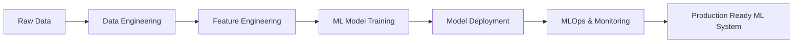

<div align="center">

# 👋 Hey there, I'm Cinar!

### Data Science Engineer | Big Data Specialist | MLOps Enthusiast


[](https://www.linkedin.com/in/muhammetcinar/)
[](https://cinar-muhammet.streamlit.app)
[](mailto:mhmmtcnr81@gmail.com)


</div>

---

## 🚀 About Me

```python
class DataEngineer:
    def __init__(self):
        self.name = "Muhammet Cinar"
        self.role = "Data Science & Big Data Engineer"
        self.education = "Electronics & Communication Engineering @ Kocaeli University"
        self.location = "Turkey"
        self.interests = ["Machine Learning", "MLOps", "Data Engineering", "Cloud Architecture"]
    
    def say_hi(self):
        print("Thanks for dropping by! Let's build something amazing together!")

me = DataEngineer()
me.say_hi()
```

---

## 🛠️ Tech Stack & Tools

### 💻 Programming & Data Science


### ☁️ Cloud & DevOps


### 🗄️ Data Engineering & Big Data


### 🔧 MLOps & API


---

## 📊 GitHub Statistics

<div align="center">
  
  
</div>

<div align="center">
  
</div>

<div align="center">
  
</div>

---

## 📈 Contribution Graph

<div align="center">
  
</div>

---

## 💼 What I Do



### 🎯 Core Competencies

- **Machine Learning & Deep Learning**: Building and deploying predictive models
- **Big Data Processing**: Handling large-scale data pipelines with Spark & Kafka
- **Cloud Architecture**: Designing scalable solutions on AWS & GCP
- **MLOps**: End-to-end ML pipeline automation and monitoring
- **Data Engineering**: ETL/ELT pipelines, data warehousing, and orchestration

---

## 🌟 Featured Projects

<div align="center">

[](https://github.com/cinarolog/your-awesome-project)
[](https://github.com/cinarolog/another-cool-project)

</div>

---

## 📫 Let's Connect!

<div align="center">

I'm always interested in collaborating on exciting data science and ML projects. Feel free to reach out!

[](https://www.linkedin.com/in/muhammetcinar/)
[](https://cinar-muhammet.streamlit.app)

</div>

---

<div align="center">
  
### 💭 Quote of the Day


---

**"Data is the new oil, but only if you know how to refine it!"** 🚀


<sub>⭐️ From [cinarolog](https://github.com/cinarolog) with 💙</sub>

</div>
