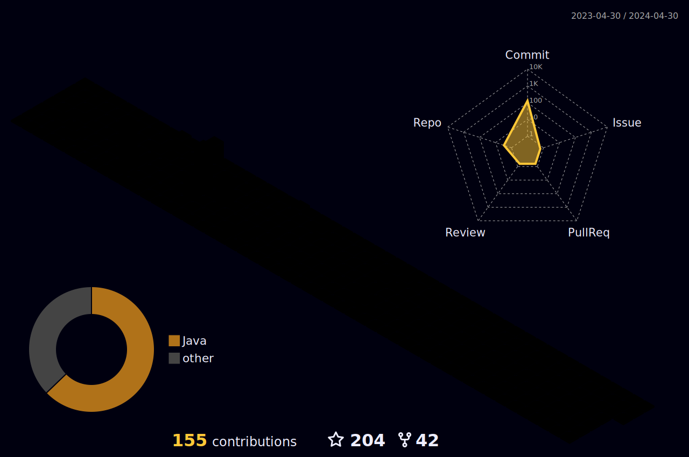

 

 

<h2 align="center">
</h2>  

 

<h2 dir="auto"><a id="user-content-necktie-about-me" class="anchor" aria-hidden="true" href="#necktie-about-me"><svg class="octicon octicon-link" viewBox="0 0 16 16" version="1.1" width="16" height="16" aria-hidden="true"><path fill-rule="evenodd" d="M7.775 3.275a.75.75 0 001.06 1.06l1.25-1.25a2 2 0 112.83 2.83l-2.5 2.5a2 2 0 01-2.83 0 .75.75 0 00-1.06 1.06 3.5 3.5 0 004.95 0l2.5-2.5a3.5 3.5 0 00-4.95-4.95l-1.25 1.25zm-4.69 9.64a2 2 0 010-2.83l2.5-2.5a2 2 0 012.83 0 .75.75 0 001.06-1.06 3.5 3.5 0 00-4.95 0l-2.5 2.5a3.5 3.5 0 004.95 4.95l1.25-1.25a.75.75 0 00-1.06-1.06l-1.25 1.25a2 2 0 01-2.83 0z">

### </path></svg></a> Heeey ! I am Cinar ✅ </h2>

</a>

<!-- %7C -> alttaki yaziya | eklememize yariyor -->

  
<h3 align="left">Skills: Python | Machine Learning | Deep Learning | Data Engineering | MLops | AWS-GCP | PostgreSQL-Oracle | </h3>
 

## <b> Languages and Tools:</b>
</a> 

</a>

 
</a>
 

 

 

 
  
  
  
  

 

 
 
##  <b>My Stats</b>

  
  
  

 

